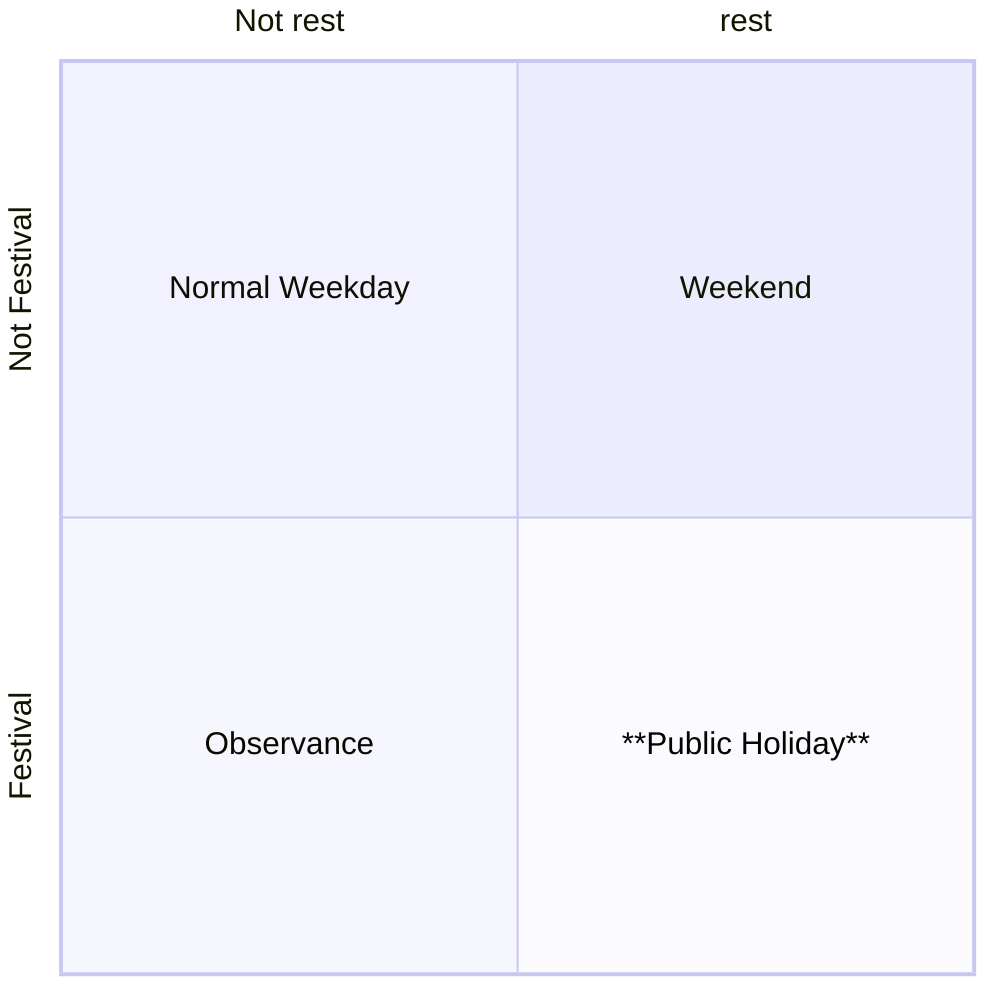

## 一、节日、假日、节假日

| **概念** | **定义** | **侧重点** | **示例** |
| --- | --- | --- | --- |
| **节日Festival** | 具有文化、宗教或社会意义的特定纪念日或庆典日，可能包含放假安排，但不必然。 | **文化属性**（庆祝、仪式） | 春节、中秋节、端午节、圣诞节 |
| **假日Holiday** | 法律或社会约定的休息日，强调“非工作日”状态，不一定有文化意义。 | **时间属性**（休息、放假） | 周末、调休补休、年假、病假 |
| **节假日Public Holiday** | 兼具“节日”文化属性与“假日”休息属性的特殊日期，通常为**法定**放假安排的节日。 | **双重属性**（文化+休息） | 春节（法定假）、国庆节（法定假） |
- 节日（Festival）是特定日期的庆祝或纪念活动。
- 假日（Holiday）是放假休息的日子。
- 节假日（Public Holiday）是结合节日与放假的日期。

|  | 不放假 | 放假 |
| --- | --- | --- |
| 不是节日 | 普通工作日+上班调休日 | 放假的周末 |
| 节日 | 不放假节日 | 法定节假日 |

## **二、广义节假日分类**

1. **类型**
    1. 法定节假日：国庆、春节，中秋等
    2. 纪念日：植树节、情人节、教师节、重阳节
    3. 节气（季节相关）：春分、夏至、秋分、冬至
    4. 休息日（周末）：世界普遍是一周5天工作日，周六周日休息，埃及是周五周六是周末
    5. 宗教节日：如伊斯兰国家的开斋节、圣诞节等，与宗教信仰相关
    6. 临时新增的节假日，比如澳大利亚在2022年新增英国女王陛下哀悼日。
2. **放假地区范围**
    1. 全国放假  
    2. 部分州/城市放假 
    3. 由于时区原因不同地区 假期开始时间有差距（巴西有4个时区，一个时区进入假期，另外一个时区还没进入）
3. **日历类型**
    1. 公历 ：比如新年1.1、劳动节、国庆是按照公历放假
    2. 农历：比如春节、端午、中秋是按照农历放假
    3. 伊斯兰历：比如开斋节、宰牲节、斋月
4. **放假人群范围**
    1. 全体放假
    2. 部分职业/行业放假，比如银行节假日、学生暑假寒假。[妇女节](https://zh.wikipedia.org/wiki/%E5%9C%8B%E9%9A%9B%E5%A9%A6%E5%A5%B3%E7%AF%80)：3月8日，妇女放假半天、[青年节](https://zh.wikipedia.org/wiki/%E9%9D%92%E5%B9%B4%E8%8A%82)：5月4日，14周岁以上青年放假半天、[儿童节](https://zh.wikipedia.org/wiki/%E5%84%BF%E7%AB%A5%E8%8A%82)：6月1日，不满14周岁少年儿童放假一天、[建军节](https://zh.wikipedia.org/wiki/%E4%B8%AD%E5%9B%BD%E4%BA%BA%E6%B0%91%E8%A7%A3%E6%94%BE%E5%86%9B%E5%BB%BA%E5%86%9B%E7%BA%AA%E5%BF%B5%E6%97%A5)：8月1日，现役军人放假半天。
    3. 纪念日 不放假，但是确实对订单有影响（七夕）

**总结：各国的节假日受到  日历类型、国家法律等影响 不尽相同，没有标准分类，需要人为干预**

## 三、节假日影响的业务场景

1、运营场景

| 业务方向 | 业务场景 | 备注 |
| --- | --- | --- |
| 商家端 | 商家营业时间需要考虑节假日，节假日会有特殊的营业时间 | 需要考虑节日+假日 |
|  | 沙特斋月祷告时间，商家自动置休 |  |
| 骑手端 | 骑手排班时间考虑节假日 | 需要考虑节日+假日 |
|  | 节假日可能会导致单量暴增，可能需要调整骑手配送范围 | 需要考虑节日+假日 |
|  |  |  |
| 用户端 | 节假日，可能需要配置特定营销活动、运营策略 | 需要考虑节日+假日 |
|  |  |  |
| 企业内部 | 内部数据统计分析，需要考虑节假日的影响 | 需要考虑节日+假日 |
|  | 审核任务过期时间 | 仅需要考虑假日 |

2、结算场景

| 业务方向 | 业务场景 | 备注 |
| --- | --- | --- |
| 内部财务 | 员工发薪时间需要在工作日 | 仅需要考虑假日 |
|  | 员工加班，法定节假日加班3倍工资，普通周末加班换调休 | 考虑是否是法定节假日 |
| 商家结算 | 付款日期需要跳过银行节假日，此时打款无法到账 | 考虑银行是否放假 |
|  |  |  |

总结：

- 有些场景只关心放不放假（发薪、打款、工作时长等），不关心是否是节日
- 也有些场景既要关心放不放假，还要关心是不是节日（影响单量、影响供需）

放假时间：普通周末+法定节假日

节日时间：普通节日+法定节假日

能力从低到高：

- **放假（Weekend）:周末是周几**，注意有些国家是周六周日，有些国家是周五周六，还有些国家是4.5天工作日
- **放假（Public Holiday）:全国、所有人都放假的法定节假日**
- 放假：部分城市地区、部分人群、部分行业放假的法定节假日，如圣保罗生日、妇女节、银行假日（Bank Holiday）
- 节日：不放假的节日，如情人节、植树节

## 四、需要的接口

1. 获取周末是周几？
2. 根据国家、日期范围，列出全国放假的法定节假日列表
3. 计算某天前/后第N个工作日
4. 根据国家、日期范围，列出不一定放假的节日列表