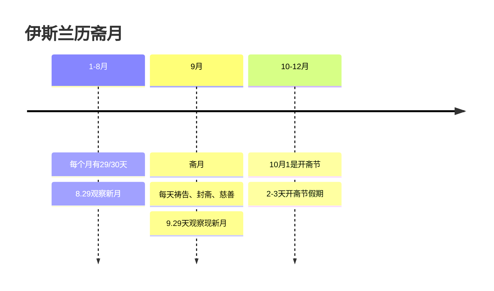
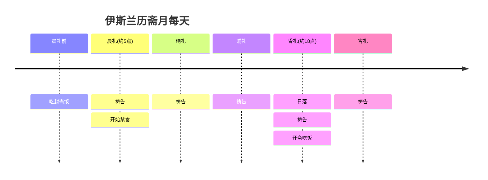

# 伊斯兰教-斋月和开斋节
## 一、简介





### 斋月

斋月是穆斯林禁食和祷告的月份（非节日或假日），是在伊斯兰历的第九个月，历时整整一个月。

斋月期间每天长时间禁食、做灵修与慈善。、

用餐习惯：穆斯林在斋月期间每天只吃两餐，分别为Suhur (3-4am)和Iftar (~6:30pm)，两餐之间为禁食期。

### **开斋节**

开斋节，阿拉伯语称“Eid al-Fitr”，标志着斋月的结束，在伊斯兰历10月（闪瓦鲁月）的第一天举行。

| **方面** | **斋月** | **开斋节** |
| --- | --- | --- |
| **性质** | 神圣的功修月，强调克制与自律 | 欢乐的庆祝节日，强调分享与喜悦 |
| **时间** | 伊斯兰历9月，**整整一个月** | 伊斯兰历10月**初一**，**通常庆祝1-3天** |
| **核心** | **封斋**、祈祷、反思、斋戒 | **聚餐**、社交、穿新衣、互赠礼物 |
| **氛围** | 庄严、宁静、内省 | 热闹、喜庆、充满活力 |
| **关系** | 因：一个月的修炼与积累 | 果：功修圆满后的庆祝与感恩 |


## 二、斋月和开斋节的日期是如何确定的

### **1、确定斋月开始**

其核心规则非常简单直接：**在伊斯兰历8月（舍尔邦月）的第29日日落之后，观测新月（月牙）。**

根据观测结果，有两种情况：

- **如果新月被观测到**，那么伊斯兰历9月（赖麦丹月，即斋月）就从**次日**正式开始。
- **如果未能观测到新月**，那么舍尔邦月就补足30天，斋月从**后天**开始。

### 2、确定开斋节的开始

开斋节的具体公历日期每年不同，需要通过“看月”来确定，这也进一步印证了它必须在斋月之后：

- **观测新月**：在伊斯兰历**斋月（第九个月）的第29天傍晚**，官方新月观测委员会会观测新月。
- **两种结果**：
    - **如果看到新月**：那么当天晚上之后，斋月就结束了，**次日即为开斋节**。
    - **如果没看到新月**：那么斋月就补足30天，**斋月结束后的一天为开斋节**。

所以，无论新月是否被观测到，开斋节都**必定始于斋月完全结束之后的第二天**。

**开斋节可能遵循邻国或权威的宣布**：

- 许多国家和地区（尤其是海湾合作委员会GCC国家）会遵循某个权威的宣布。传统上，许多地方会遵从**沙特阿拉伯**的官方宣布，因为沙特是伊斯兰教两大圣地的所在地。
- 但是，每个国家都拥有自主决定权，因此有时会出现沙特宣布开始，而其他国家因本地未观测到而次日才开始的情况。

## 三、斋月相关的接口和库表设计

### 1、需要的接口

- 根据国家获取斋月开始、结束日期
- 根据城市，获取每天的5次祷告时间
- 根据城市，获取斋月期间每天封斋和开斋的时间（可复用第2个接口，因为晨礼时间=封斋时间，昏礼时间=开斋时间）

### 2、库表设计

斋月日期信息表ramadan_date

```sql
CREATE TABLE `ramadan_date` (
  `id` bigint(20) NOT NULL AUTO_INCREMENT COMMENT '主键ID',
  `region` varchar(5) NOT NULL DEFAULT '' COMMENT '国家二字母码（ISO 3166-1 alpha-2）',
  `islamic_year` int(4) NOT NULL DEFAULT '0' COMMENT '伊斯兰历年（如：1446）',
  `start_date` date NOT NULL DEFAULT '1970-01-01' COMMENT '斋月开始公历日期',
  `end_date` date NOT NULL DEFAULT '1970-01-01' COMMENT '斋月结束公历日期',
  `ctime` bigint(20) NOT NULL DEFAULT '0' COMMENT '创建时间（Unix毫秒时间戳）',
  `utime` bigint(20) NOT NULL DEFAULT '0' COMMENT '更新时间（Unix毫秒时间戳）',
  `operator` varchar(64) NOT NULL DEFAULT '' COMMENT '更新人',
  PRIMARY KEY (`id`),
  UNIQUE KEY `uk_region_islamic_year` (`region`,`islamic_year`)
) ENGINE=InnoDB DEFAULT CHARSET=utf8mb4 COMMENT='斋月起止日期记录表'
```

祷告时间表prayer_times

```sql
CREATE TABLE `prayer_times` (
  `id` bigint(20) NOT NULL AUTO_INCREMENT COMMENT '主键ID',
  `region` varchar(5) NOT NULL DEFAULT '' COMMENT '国家二字母码（ISO 3166-1 alpha-2）',
  `city_id` bigint(20) NOT NULL DEFAULT '0' COMMENT '城市id',
  `gregorian_date` date NOT NULL DEFAULT '1970-01-01' COMMENT '公历日期',
  `fajr` TIME NOT NULL DEFAULT '00:00:00' COMMENT '晨礼时间',
  `sunrise` TIME NOT NULL DEFAULT '00:00:00' COMMENT '日出时间',
  `dhuhr` TIME NOT NULL DEFAULT '00:00:00' COMMENT '晌礼时间',
  `asr` TIME NOT NULL DEFAULT '00:00:00' COMMENT '晡礼时间',
  `maghrib` TIME NOT NULL DEFAULT '00:00:00' COMMENT '昏礼时间（日落时间）',
  `isha` TIME NOT NULL DEFAULT '00:00:00' COMMENT '宵礼时间',
  `ctime` bigint(20) NOT NULL DEFAULT '0' COMMENT '创建时间（Unix毫秒时间戳）',
  `utime` bigint(20) NOT NULL DEFAULT '0' COMMENT '更新时间（Unix毫秒时间戳）',
  `operator` varchar(64) NOT NULL DEFAULT '' COMMENT '更新人',
  PRIMARY KEY (`id`),
  UNIQUE KEY `uniq_city_id_date` (`city_id`,`gregorian_date`)
) ENGINE=InnoDB DEFAULT CHARSET=utf8mb4 COLLATE=utf8mb4_unicode_ci
```

