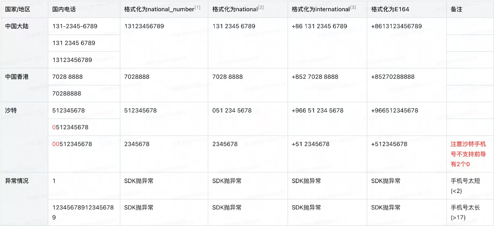

# 基础概念

## 一、电话号码的组成

> **国际电话号码 = 国际冠码 + 国际电话区号 + 电话号码**
> 

国际电话号码比如 00 86 2150504740、+86 13112345678

- **国际冠码** ：拨出电话时候，由**拨出地区**确定的一个前缀，不同国家使用不同的标准，比如中国大陆使用 “00” 为国际冠码，拨打国际电话的时候要根据拨出地区确定国际冠码，同时，由于这个冠码太繁琐，可以使用“+”来代替任何国家的国家冠码。
- **国际电话区号**： 表示你要 **拨到哪里** ，每个国家分配的一个代码，我们熟悉的 ”86“ 是中国大陆， ”852“是中国香港，”1“ 是美国。“+86”就是由国际冠码与国际电话区号组成的。
- **电话号码**：有了上述两个部分，电话号码就确定了国家（地区），剩下的部分就是内部的电话号码了，每个不同国家、不同地区，都有可能有自己内部的电话号码格式，不过这个部分就是日常生活中最常用的部分，大家会熟悉很多。

举例： 假设我香港的朋友，告诉我他的电话号码是 51231234，我要给他打电话：

1. 我需要确定我是从中国大陆拨打电话，中国大陆的国际冠码是 00，或者我不知道我的国际冠码，直接用通用的冠码 +；
2. 我需要确定香港地区的电话区号，是 852；
3. 在朋友给我的号码前面加上上述号码，拨打 0085251231234 或者 +85251231234 才能正确拨打。

[国际电话区号列表](https://zh.wikipedia.org/wiki/%E5%9B%BD%E9%99%85%E7%94%B5%E8%AF%9D%E5%8C%BA%E5%8F%B7%E5%88%97%E8%A1%A8)

## 二、电话号码格式类型

### 格式分类

- **national_number**：国内纯数字格式。只包含数字，不带前导0，不带空格等特殊字符。例如“446681800”。当国家区号和国内电话存为2个字段时，适合用来作为国内电话存储。 
- **national format**：国内格式，一般不包含国家代码，可以有空格或其他分隔符。例如"044 668 1800"。适合用来展示和拨打国内电话。 
- **international format**：国际格式，包含国际前缀+、国家区号和国内电话号码，可以有空格或其他分隔符。例如"+41 44 668 1800"。适合用来展示和拨打国际电话。 
- **E.164**：是由国际电信联盟（ITU）制定的一种国际电话号码的标准格式，和国际格式相同，但没有任何空格或者其他分隔符。例如"+41446681800"。适合用来存储和拨打电话。 
- **RFC3966**：是一种网络电话URI的格式，包含"tel:"的前缀，所有的空格和其他分隔符都被连字符替换，电话号码的扩展部分以";ext="附加，例如"tel:+41-44-668-1800"。

## 三、电话号码类型

- **FIXED_LINE固定电话**： 通常指的是家庭或办公室的固定电话号码，也就是我们通常所说的座机号码。这种电话号码需要通过固定的电话线路进行通信。
- **MOBILE移动电话**
- **TOLL_FREE免费电话**：是我们通常说的"800"电话号码。拨打这种电话号码的费用由被叫方支付。
- **PREMIUM_RATE增值服务电话** ：是我们通常说的"900"电话号码。拨打这种电话号码的费用比普通电话号码高，费用中的一部分会作为服务费支付给电话服务提供商。
- **SHARED_COST费用共享电话** ：拨打这种电话号码的费用会被主叫方和被叫方共同承担。
- **VOIP** 语音网际协议(Voice over Internet Protocol)电话号码：通过互联网进行语音通信。
- **PERSONAL_NUMBER** ：个人号码。这种电话号码通常被一个人用于多种用途，比如家庭、办公室和手机。
- **UAN**：这种类型的电话号码通常指的是全国统一服务电话号码。这个号码在一个国家的所有地方都是相同的。
- **PAGER（寻呼机号码）：**寻呼机号码是分配给个人或企业寻呼机（也称为BP机或Beeper）的号码。寻呼机是一种无线电频率接收设备，用于接收简短的文本消息或呼叫信号。虽然寻呼机的使用已大幅减少，因为移动电话和智能手机提供了更高级的通信方式，但在某些特定行业，如医疗保健，寻呼机仍然被使用。寻呼机号码通常是电话号码系统的一部分，但它们并不直接用于语音通信，而是用于发送数字或文本消息到寻呼机设备。

## 四、电话号码的的错误观念

> 原文：https://github.com/google/libphonenumber/blob/master/FALSEHOODS.md

以及如何使用libphonenumber的提示。

考虑到电话号码的普及程度和它们存在的时间之长，程序员们对它们仍然存在许多错误的假设，这令人惊讶。

### 个人拥有一个电话号码

有些人没有电话，或者当被问及时不愿意提供他们的电话号码。除非电话号码是必需的，否则不要要求用户提供电话号码，并在可能的情况下提供备用方案以适应这些用户。

### 你可以拨打任何电话号码

一些设备，如EFTPOS终端、传真机和移动互联网设备可能不支持接听电话。此外，有些人无法使用他们的手机打电话。这可能是永久性的（如听力障碍）、暂时性的（暂时性听力丧失）或情境性的（用户处于嘈杂的环境中）。

**提示：** 让用户清楚地了解他们如何使用电话号码，并给他们设置偏好的选项。在尝试与用户进行通信之前，请确保查找此偏好。

### 一个个人只有一个电话号码

显然，这并不一定是真实的。

### 电话号码可以唯一地识别一个个人

即使不久以前移动电话不存在，整个家庭共享一个固定电话号码是很常见的。在世界的一些地区，这仍然是真实的，亲戚（甚至朋友）共享一个电话号码。许多电话服务（尤其是用于企业）允许多个呼入呼出的电话使用同一个电话号码。

### 电话号码不能被重新使用

旧的电话号码会被回收并重新分配给其他人。

### 今天有效的电话号码将永远有效。今天某种类型的电话号码（例如移动电话）将永远不会被重新分配给其他类型。

今天能够连接的电话号码明天可能会被断开。今天可以免费拨打的号码明天可能需要支付费用。电话公司可能决定通过在现有号码中插入一个数字来扩大可用电话号码的范围。

**提示：** 不要存储电话号码的有效性valid或类型type等属性。在需要时，从库中重新检查这些信息。

### 每个国家区号对应于一个国家

美国、加拿大和几个加勒比岛屿共享国家区号+1。俄罗斯和哈萨克斯坦共享+7。这些不是唯一的例子！

### 每个国家只有一个国家区号

截至目前（2016年3月），在有争议的领土和部分承认的科索沃，可以通过拨打塞尔维亚（+381）、斯洛文尼亚（+386）或摩纳哥（+377）的国家区号来拨打电话，具体取决于何时何地获得号码。

**提示：** 使用电话小部件鼓励用户以国际格式输入电话号码，以便可以明确地理解。

### 可以从任何地方拨打电话号码

有些号码只能在国内拨打。有些号码只能在一些国家或地区内拨打，例如+800的通用国际免费电话号码。一些号码只有在呼叫者是特定电信公司的订户时才能拨打。

### 你可以向任何电话号码发送短信

许多人仍然只有固定电话，这种电话通常无法发送或接收短信。

**提示：** 在可能的情况下，尝试通过语音留言或语音提示来满足这些用户的需求。或者，如果您的服务需要发送短信，请在用户提供号码后验证该号码是否可以接收短信。

### 只有移动电话才能接收短信

一些服务提供商支持向固定电话号码发送和接收短信。还有在线服务（如Skype）可以发送和接收短信。

### 只有国内呼叫和国际呼叫两种方式可以拨打电话号码

一些号码可能需要不同的前缀，这取决于：您正在使用的运营商；您正在拨打/接听电话的设备；您是在特定地理区域内还是外部。

例如：
在巴西，要在国内拨打号码但跨越某个地理边界，必须显式拨打运营商代码，以说明您将使用哪个运营商支付通话费用。
在尼泊尔，根据起始电话是移动电话还是固定电话，国内格式中的前导零可能被省略。
在新西兰，即使号码与您所在的区号相同，您仍需要拨打区号（例如03），除非它是“接近”（大致接近城市/地区边界），在这种情况下不应拨打。

**提示：** 使用formatForMobileDialling获取用户应在其移动电话上实际拨打的号码。

### 要使号码可拨打，只需更改前缀

在阿根廷，要在国内拨打移动电话号码，需要在区号之后但本地号码之前插入数字“15”，并删除国家代码（54）后的“9”。这将+54 9 2982 123456转换为02982 15 123456。

### 有效电话号码的前缀不能是有效电话号码

在某些国家，通过在号码后拨打更多数字，可以连接到不同的终端。因此，“12345678”可能无法与拨打“123456”的人联系到同一个人。

### 一个无效的号码将无法连接到终端

在某些国家或某些手机上，额外的数字会被丢弃。因此，1-800-MICROSOFT是一个无效的号码，但它仍然可以连接到Microsoft，因为后面的任何数字都会被忽略。在某些国家，可以通过拨打"911 123"来拨打"911"，但在其他国家则不行。

在其他国家，无效的号码可能会被运营商"修复"，例如，如果他们知道这是一个移动电话号码，他们可以添加一个移动标识符来连接。

### 所有有效的电话号码都遵循ITU规范

ITU-T规定电话号码不能超过15位数字，其中一到三位数字为国家区号保留，但德国的有效号码长度超过了这个限制。

### 所有有效的电话号码都属于一个国家

许多"国家区号"是发放给非地理实体的，例如卫星服务，以及通用国际免费电话号码的"800"区号。

### 电话号码只包含数字

在以色列，某些广告号码以\*开头。在新西兰，可以通过从移动电话拨打\*555来报告非紧急交通事故。电话号码中也可以使用字母字符，例如1-800-Flowers。

### 电话号码始终以ASCII编码书写

在埃及，电话号码通常以本地数字书写。

### 电话号码在给定时间只有一个前缀（区号或国内区号）

在90年代中期的冰岛，电话号码从5位和6位变成了7位。旧系统具有区域前缀，但新系统没有。在过渡期间，电话号码可以通过旧的区号或新的7位数（不同的前缀）到达。例如，雷克雅未克的电话号码可以在区域内使用nnnnn和55nnnnn拨号，在外部使用91-nnnnn和55nnnnn拨号。

**提示：** 在过渡期间，确保号码的两种形式都支持通过电话号码进行查找。如果发送消息/拨打受影响的号码，可能需要尝试新的和旧的前缀。根据过渡类型，您可能需要联系受影响的客户并要求他们更新其号码。

### 格式化为国内使用的号码中的前导零在从国外拨打时总是可以丢弃的

在一些国家，人们在国家区号之后使用括号（通常为(0)）来写入国内前缀，表示在国际拨号时它应该被丢弃。在意大利，自1998年以来，前缀被"固定"到电话号码上，因此(01) 2345变为012345，应该（国际上）拨打为+39012345（包括前导零）。

**提示：** 使用库来解析和格式化号码，以便为每个国家正确处理此问题。

### 电话号码的国家或区号表示用户的位置、居住地、时区或首选语言

有很多原因使某人在与其居住地或国籍不同的州或地区拥有电话号码。

这些原因包括但不限于：

在一个国家内搬家：在具有电话号码可携带性的国家，您可以在搬家时保留您的号码，甚至在某些情况下，即使它是一个固定电话号码，即使它有一个区号（在美国的一个例子中可以参考xkcd）。
搬到另一个国家：有些人在搬到另一个国家时保留他们的手机。
地缘政治动荡：有时候国家会改变边界，停止存在或出现。
商业、家庭和朋友：企业可能在邻国拥有许多客户，或者个人在那里有很多家人和朋友。
希望获得更便宜的费率：VoIP通常比常规电话呼叫便宜。在欧洲旅行的人可能会从一个国家获得SIM卡，并拥有漫游计划。
请注意，某些国家为移动电话分配地理区号。

**提示：** 程序员不应仅因为电话号码属于另一个国家而禁止用户注册。在调用isValidNumberForRegion等方法时，应注意这是实际意图。如果您有一个电话输入小部件，请确保允许以国际格式（即允许+符号）输入号码，以便人们可以使用国际联系号码注册。

### 国际格式电话号码前面的加号符号是可选的，或者总是可以用00替换

加号符号是国际电话号码的一部分，称为E.164格式。在国际拨号时，它可以替换为国际呼叫前缀。请注意，虽然00是常用的国际呼叫前缀，但具体的前缀因国家而异。

在拥有国家区号+1的北美地区，常见错误是省略号码前面的+，将其写为1-555-123-4567。这在技术上是不正确的。要从国际上的日本拨打该号码，国际呼叫前缀是010，可以拨打+1 555 123 4567或010 1 555 123 4567。

### 用户只会在产品的电话号码字段中存储电话号码

有些用户使用他们的联系人列表来存储诸如生日或其他信息。除非经过验证确实是电话号码，否则应将用户提供的数据按其输入的方式存储。

### 电话号码就是数字

永远不要尝试将电话号码存储为int或任何其他类型的数字数据。您无法对其进行算术操作，而且尽管007、07和7是相同的数字，但它们不一定是相同的电话号码 - 在某些国家，前导0是重要的，它是号码本身的一部分（参见格式化为国内使用的号码中的前导零在从国外拨打时总是可以丢弃的）。此外，电话号码可能包含其他可拨号字符（参见电话号码只包含数字）或等待音调后拨号的分机部分。

- *提示：**使用库来解析和格式化号码，以便为每个国家正确处理此问题。

### 政府或电信发布的电话号码计划代表现实

国家号码计划（例如ITU管理的号码计划）代表政府或电信的意图。这些可能在实际实施号码计划变更之前、期间或之后发布。电话号码范围的实际生效日期可能不总是遵守官方公告。