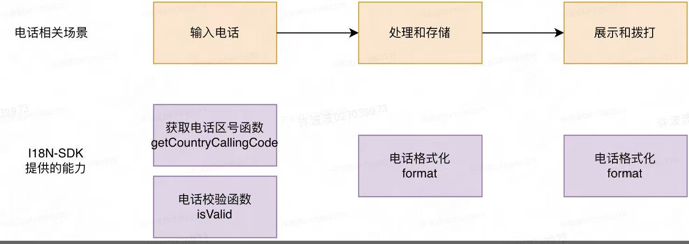

## 电话输入
1、所有的国家区号列表，统一从i18n服务获取。

2、电话校验，前端调用i18n-api接口进行校验，后端也统一使用i18n-sdk进行校验。

## 电话处理
1、用户注册时，为防止一个手机号被注册多次，需要处理成完全一致的格式。

> 如果不统一格式，用户可能在前面加个前导0或者加个国家区号，也能正常收到验证码，这样会重复注册。

## 电话存储
1、存储为“国家区号” + “_” + “国内纯数字电话号”的格式，如86_15012346666。

> 有些国家的国内电话格式有时候会加前导0，如沙特“051 234 5678”，而国内纯数字格式，不会包含前导0。可以保证用户输不输入0，最终保存时都是一致的。

2、电话存储需要加密（合规要求），明文仅保存在中心服务，普通服务保存一个token，要使用真实手机号时再从中心服务获取明文。

## 电话展示
1、 用户电话给他人展示时（无需拨打），为保证信息安全，需要进行掩码展示，如130****1234，或仅展示电话尾号1234。

## 电话拨打
1、电话拨打前，统一使用i18n-sdk格式化为E164格式进行拨打。
