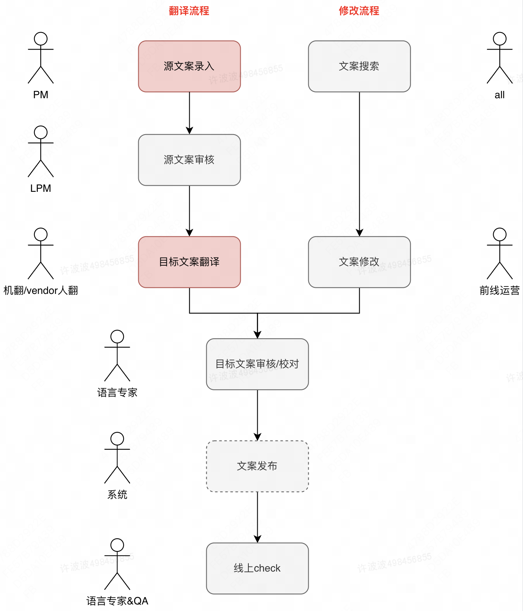
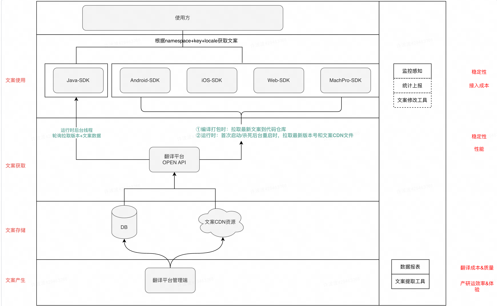

# 翻译Translation
每个公司的业务要出海，首先需要先做好翻译。
包括应用的文案、图片等内容。

一般是用一套 翻译管理平台+翻译SDK，用来解决产品出海翻译问题。


## 文案分类

按源文案由谁书写分类

| 文案类型 | 例子 | 翻译质量| 翻译效率 | 多国家?  | 长度 | 时效性 | 翻译特点 | 管理平台 |
| --- | --- | --- | --- | --- | --- | --- |  --- | --- |
| 产品功能文案 | 按钮、错误提示、功能名称 | 高 | 中等 | 全球多国家 | 短 | 长时间 | 简短、一致性 | 翻译平台 |
| 运营配置文案 | 营销活动标题、内容；骑手培训标题、内容；客服FAQ；客服工作台；店铺名、商品类目、商品名 | 中| 高 | 营销活动单个国家；客服工具多国家  | 中等 | 短时间 | 有感染力 | 营销系统 |
| 法务书写文案 | 隐私协议；合同 | 极高 | 中 | 单国 | 长 | 长时间 | 详细、正式、专业术语多 | 业务系统 |
| 用户产生文案UGC | 用户评论；用户地址 | 低 | 高 | 单国 | 中等 | 长时间 | 口语化 | 业务系统 |


## 业务接入改造流程
```mermaid
---
title: 大概流程
---
flowchart LR
    提取代码中的文案 --> 翻译文案 --> 代码改造，使用文案
```

- 文案提取工具：帮助业务提取代码中的文案
- 翻译平台：帮助翻译和维护多语言文案
- 翻译SDK：帮助业务快速使用多语言文案

## 翻译流程


## 翻译系统架构
